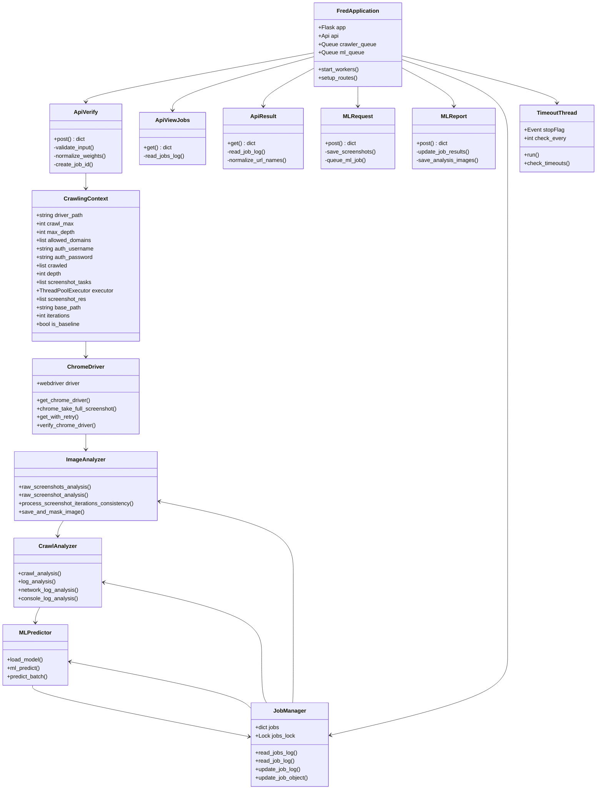
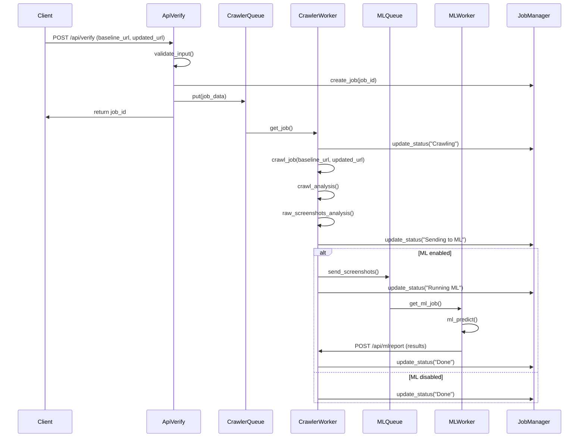
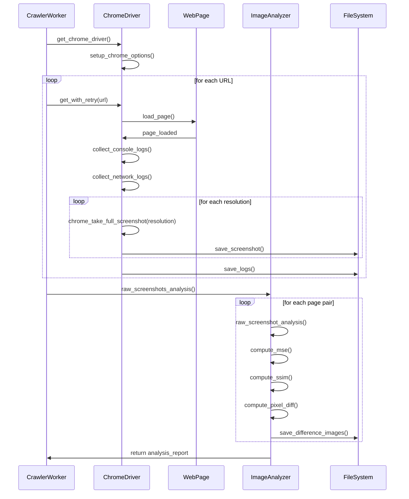
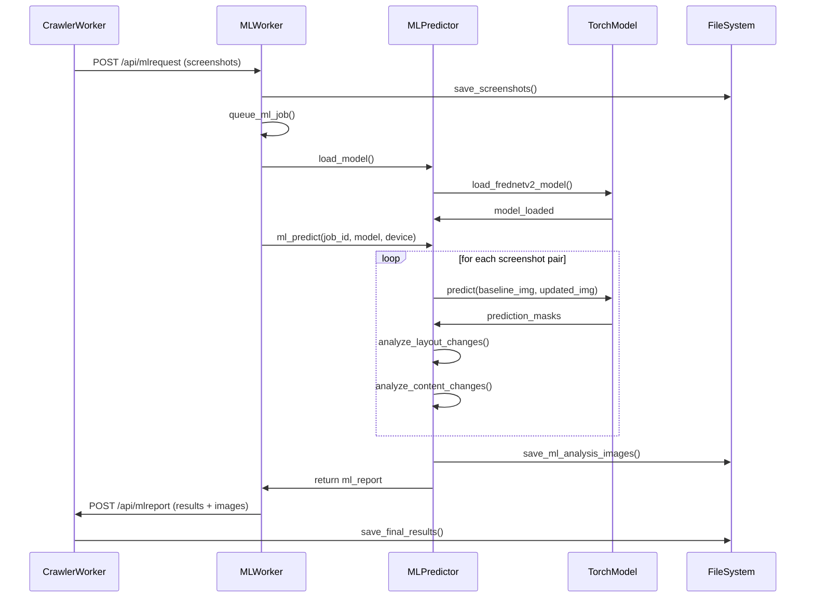

# FRED (Frontend Regression Validator) - Codebase Analysis

## Executive Summary

FRED (Frontend Regression Validator) is a sophisticated visual regression testing tool designed to compare two versions of websites. The system employs a multi-component architecture with separate crawler and ML analysis capabilities, making it highly scalable for enterprise use.

## System Architecture Overview

FRED is built as a REST API service with queue-based job processing, supporting both traditional screenshot comparison and advanced ML-powered visual analysis. The system can be deployed as a single instance or distributed across multiple machines for scalability.

### Key Design Patterns
- **REST API Architecture**: Flask-based web service with RESTful endpoints
- **Producer-Consumer Pattern**: Queue-based job processing with worker threads
- **Component Separation**: Crawler and ML components can run independently
- **Multi-threading**: Concurrent processing of crawling and ML analysis jobs
- **Plugin Architecture**: Modular ML model integration

## Class Diagram



## Sequence Diagrams

### 1. Main Job Processing Flow



### 2. Screenshot Capture and Analysis Flow



### 3. ML Analysis Flow



## Component Analysis

### 1. Core Components

#### Flask Application (`fred/run.py`)
- **Purpose**: Main entry point and API server
- **Key Features**:
  - REST API endpoints for job management
  - Multi-threaded worker management
  - Queue-based job processing
  - File serving for results visualization

#### Web Crawler (`fred/crawl.py`)
- **Purpose**: Website crawling and screenshot capture
- **Key Features**:
  - Selenium-based web automation
  - Multi-resolution screenshot capture
  - Network and console log collection
  - Basic authentication support
  - Concurrent crawling with thread pool

#### Image Analysis (`fred/image_analysis.py`)
- **Purpose**: Raw screenshot comparison and analysis
- **Key Features**:
  - Mean Squared Error (MSE) calculation
  - Structural Similarity Index (SSIM) computation
  - Pixel-level difference analysis
  - Dynamic content masking
  - Difference visualization generation

#### Crawl Analysis (`fred/crawl_analysis.py`)
- **Purpose**: Console and network log comparison
- **Key Features**:
  - Console log divergence detection
  - Network request comparison
  - Status code analysis
  - Performance metrics comparison

### 2. Machine Learning Components

#### ML Predictor (`fred/ml/predict.py`)
- **Purpose**: Advanced visual analysis using deep learning
- **Key Features**:
  - Custom FredNetV2 architecture
  - Layout vs content change detection
  - GPU acceleration support
  - Image segmentation for content masking

#### Model Architecture (`fred/ml/encoder_decoder_frednetv2.py`)
- **Purpose**: Deep learning model for visual understanding
- **Architecture**: U-Net style encoder-decoder with custom modifications
- **Features**:
  - Multi-scale feature extraction
  - Semantic segmentation capabilities
  - Reduced false positives from dynamic content

### 3. Utility Components

#### Job Management (`fred/utils/utils.py`)
- **Purpose**: Job lifecycle and data management
- **Key Features**:
  - JSON-based job persistence
  - Thread-safe job updates
  - Timeout handling
  - Score calculation and weighting

#### Global Configuration (`fred/globals.py`)
- **Purpose**: System-wide configuration and constants
- **Key Settings**:
  - Status codes and state management
  - Threading and timeout configurations
  - Image processing parameters

## Library Dependency Analysis

### Current Dependencies Status

| Package | Current Version | Latest Version | Status | Security Risk |
|---------|----------------|----------------|---------|---------------|
| **selenium** | 3.141.0 | 4.35.0 | ⚠️ **OUTDATED** | **HIGH** - Missing security patches |
| **selenium-wire** | 1.0.11 | 5.1.0 | ⚠️ **OUTDATED** | **MEDIUM** - API changes required |
| **requests** | Not specified | 2.32.5 | ⚠️ Missing version | **MEDIUM** |
| **numpy** | Not specified | 2.3.2 | ⚠️ Missing version | **LOW** |
| **Pillow** | Not specified | 11.3.0 | ⚠️ Missing version | **MEDIUM** - Image processing vulnerabilities |
| **beautifulsoup4** | Not specified | 4.13.4 | ⚠️ Missing version | **LOW** |
| **opencv-contrib-python** | Not specified | 4.12.0.88 | ⚠️ Missing version | **LOW** |
| **Flask** | Not specified | 3.1.2 | ⚠️ Missing version | **HIGH** - Web framework security |
| **torch** | Not specified | 2.8.0 | ⚠️ Missing version | **LOW** |
| **scikit-image** | Not specified | 0.25.2 | ⚠️ Missing version | **LOW** |
| **retry** | 0.9.2 | 0.9.2 | ✅ **UP-TO-DATE** | **LOW** |

### Critical Issues

#### 1. Selenium Version (HIGH PRIORITY)
- **Current**: 3.141.0 (Released: 2018)
- **Latest**: 4.35.0
- **Issues**:
  - Selenium 3.x is deprecated and unsupported
  - Missing 6+ years of security patches
  - Chrome/Firefox compatibility issues
  - WebDriver API changes in v4.x
- **Impact**: Core functionality at risk, security vulnerabilities

#### 2. Missing Version Specifications (MEDIUM PRIORITY)
- Most packages lack version pinning
- Potential for inconsistent deployments
- Difficulty reproducing issues
- Security vulnerability tracking impossible

#### 3. Flask and Web Dependencies (MEDIUM PRIORITY)
- Flask version unspecified
- Missing security patches for web framework
- CORS and authentication vulnerabilities possible

### Recommendations

#### Immediate Actions Required

1. **Update Selenium to 4.x**:
   ```
   selenium==4.35.0
   selenium-wire==5.1.0
   ```
   - **Breaking Changes**: WebDriver instantiation syntax changes
   - **Code Impact**: `fred/crawl.py` requires updates
   - **Testing**: Full regression testing needed

2. **Pin All Package Versions**:
   ```
   requests==2.32.5
   Flask==3.1.2
   Pillow==11.3.0
   numpy==2.3.2
   beautifulsoup4==4.13.4
   ```

3. **Security Updates**:
   - Review all packages for known CVEs
   - Implement automated security scanning
   - Regular dependency updates schedule

#### Long-term Improvements

1. **Dependency Management**:
   - Add `requirements-dev.txt` for development dependencies
   - Implement `pip-tools` for dependency resolution
   - Add Dependabot for automated updates

2. **Security Hardening**:
   - Add `bandit` for security linting
   - Implement `safety` for vulnerability scanning
   - Regular security audits

## Architecture Strengths

### 1. Scalability
- **Horizontal Scaling**: Crawler and ML components can run on separate machines
- **Vertical Scaling**: Configurable thread pools for different workloads
- **Resource Optimization**: GPU/CPU separation for cost efficiency

### 2. Modularity
- **Clean Separation**: Each component has distinct responsibilities
- **Plugin Architecture**: ML models can be swapped without core changes
- **API Design**: RESTful interface enables integration flexibility

### 3. Robustness
- **Error Handling**: Comprehensive error capture and reporting
- **Timeout Management**: Prevents hung jobs from blocking resources
- **State Management**: Persistent job tracking with recovery capabilities

## Architecture Weaknesses

### 1. Technical Debt
- **Outdated Dependencies**: Security and compatibility risks
- **Missing Tests**: No comprehensive test suite in v2
- **Code Duplication**: Some utility functions repeated across modules

### 2. Configuration Management
- **Hard-coded Values**: Many configuration options embedded in code
- **Environment Handling**: Limited environment-specific configuration
- **Documentation**: Configuration options poorly documented

### 3. Monitoring and Observability
- **Limited Metrics**: Basic logging without structured monitoring
- **No Health Checks**: Missing application health endpoints
- **Performance Monitoring**: No performance metrics collection

## Security Analysis

### Current Security Posture

#### Strengths
- **Input Validation**: URL and parameter validation in API endpoints
- **Authentication Support**: Basic auth for crawled websites
- **File System Isolation**: Jobs stored in separate directories

#### Vulnerabilities
- **Dependency Vulnerabilities**: Outdated packages with known CVEs
- **Web Security**: Missing CSRF protection, limited HTTPS enforcement
- **File Upload**: ML component accepts arbitrary file uploads
- **Command Injection**: Selenium WebDriver path handling

### Security Recommendations

1. **Immediate**:
   - Update all dependencies to latest secure versions
   - Add input sanitization for file paths
   - Implement HTTPS-only mode

2. **Short-term**:
   - Add authentication for API endpoints
   - Implement file upload validation
   - Add security headers to web responses

3. **Long-term**:
   - Regular security audits
   - Implement API rate limiting
   - Add comprehensive logging for security events

## Performance Analysis

### Current Performance Characteristics

#### Strengths
- **Concurrent Processing**: Multi-threaded crawling and ML analysis
- **Resource Management**: Configurable memory limits for large images
- **Caching**: Static file serving with appropriate headers

#### Bottlenecks
- **Single Machine Storage**: All results stored locally
- **Memory Usage**: Large images consume significant RAM
- **Sequential Processing**: Some operations not fully parallelized

### Performance Recommendations

1. **Image Processing Optimization**:
   - Implement streaming image processing
   - Add image compression options
   - Progressive loading for large screenshots

2. **Storage Optimization**:
   - Consider cloud storage integration
   - Implement result archiving
   - Add cleanup policies for old jobs

3. **Processing Pipeline**:
   - Optimize ML model inference
   - Add result caching
   - Implement progressive analysis reporting

## Future Enhancement Opportunities

### 1. Cloud Native Features
- **Container Orchestration**: Kubernetes deployment support
- **Auto-scaling**: Dynamic worker scaling based on queue length
- **Cloud Storage**: S3/GCS integration for results storage

### 2. Advanced Analytics
- **Trend Analysis**: Historical comparison tracking
- **Regression Prediction**: ML-based failure prediction
- **Custom Metrics**: Domain-specific difference detection

### 3. User Experience
- **Real-time Updates**: WebSocket-based progress reporting
- **Interactive Analysis**: Web-based difference exploration
- **Reporting**: PDF/HTML report generation

### 4. Integration Features
- **CI/CD Integration**: Native GitHub Actions/Jenkins support
- **Webhook Support**: Real-time notification system
- **API Extensions**: GraphQL API for complex queries

## Conclusion

FRED represents a well-architected visual regression testing solution with strong foundations in modularity and scalability. However, the codebase requires immediate attention to security vulnerabilities through dependency updates, particularly Selenium. The system's strength lies in its component-based architecture that enables distributed deployment and specialized resource allocation.

### Priority Action Items

1. **Critical**: Update Selenium and all dependencies with security patches
2. **High**: Implement comprehensive test coverage
3. **Medium**: Add configuration management system
4. **Medium**: Enhance monitoring and observability
5. **Low**: Plan cloud-native migration path

The system is production-ready with proper dependency management but requires modernization to meet current security and operational standards. The modular architecture provides a solid foundation for future enhancements and scaling requirements.